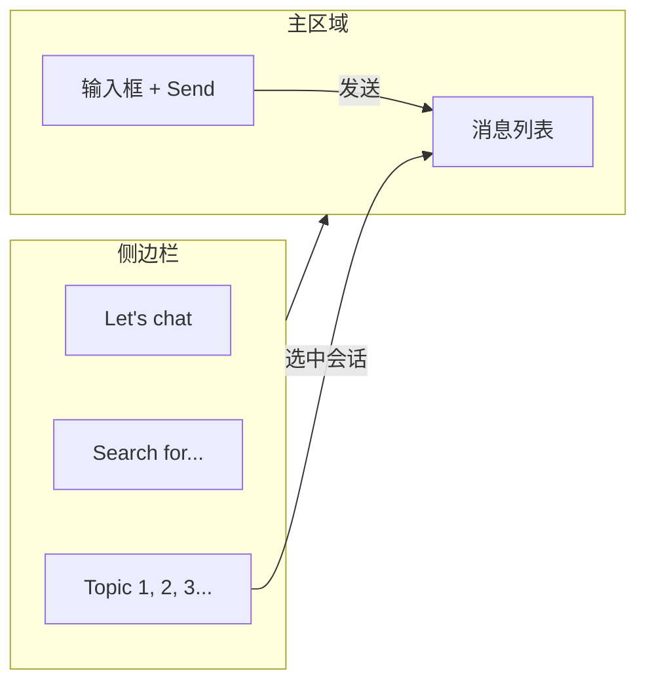

# Vue 3 LLM Chat 浏览器端项目方案

## 线框图对照与修改建议

根据你提供的 PDF 线框图（3 页），结构可归纳为：

| 线框图元素                             | 对应功能       | 方案建议                                         |
| --------------------------------- | ---------- | -------------------------------------------- |
| **Let's chat**                    | 应用标题 / 品牌  | 保留，可放在侧边栏顶部                                  |
| **Search for...**                 | 搜索框        | 用于**搜索/筛选会话列表**（Topic 1/2/3...），与“多对话管理”一致   |
| **Topic 1... Topic 2... ... 99+** | 会话列表       | 即“多对话”：每项为一条会话，点击切换；99+ 可理解为“更多”或列表过长时的折叠/分页 |
| **Send**                          | 发送按钮 + 输入区 | 主区域底部：输入框 + 发送按钮                             |
| **Menu**                          | 菜单入口       | 建议：侧边栏折叠/展开、新建聊天、设置（如 API 配置）等               |

**建议补充的线框图细节（开发时需实现）：**

- 主区域上方应有**当前会话的消息流**（user / assistant 气泡），线框图中未单独画出，需按“微信式”上下排列消息。
- 流式输出时**“AI 正在输入”**的占位（如光标或 loading），与 `isTyping` 对应。
- 移动端：侧边栏可收起，仅显示“Menu”打开侧边栏，与第 2 页“Menu + Let's chat + Send”一致。

整体流程可抽象为：

---

## 第一阶段：模型调研与 API 接入（基础设施）

- **供应商**：DeepSeek 或 Groq，兼容 OpenAI 标准（`/v1/chat/completions`），便于后续换模型。
- **获取 API Key**：在对应官网创建并复制 `API_KEY`。
- **接口测试**（先不写前端）：
  - 用 Postman 或 cURL 发 `POST`，URL 如 DeepSeek 为 `https://api.deepseek.com/v1/chat/completions`，Body 含 `model`、`messages`、`stream: true`。
  - 重点验证 **stream: true** 时返回的是 SSE（`data: {...}` 行），便于第二阶段用 `fetch` + `getReader()` 解析。

**方案修改建议：**

- 在文档或代码注释中固定一份“最小可用的请求/响应示例”（含 stream 片段），方便后续对接和排查。

---

## 第二阶段：前端脚手架与 UI 设计（骨架）

**现状：** 项目已用 Vite 搭好 Vue 3 + TypeScript，并含 Vue Router、Pinia。无需再执行 `npm create vite`。

**本阶段建议动作：**

1. **安装 Tailwind CSS**
  - 在现有 Vite 项目上按官方文档接入（`tailwindcss`、`postcss`、`autoprefixer`），并配置 `content` 指向 `index.html` 与 `src/**/*.{vue,ts}`。
2. **布局与线框图对齐**
  - 整体：左侧固定宽度侧边栏（标题 + 搜索 + 会话列表），右侧主区域（消息区 + 底部输入+Send）。  
  - 侧边栏可做响应式：小屏时默认收起，通过“Menu”按钮展开（与线框图第 2 页一致）。
3. **状态结构设计（Pinia 或组件 state）**
  - `messages: Array<{ role: 'user' | 'assistant', content: string }>` — 当前会话消息列表。  
  - `userInput: string` — 输入框绑定。  
  - `isTyping: boolean` — 是否正在接收 AI 流式输出。  
  - **多对话**：建议增加 `chats: Array<{ id: string, title: string, messages: ... }>` 和 `currentChatId: string`，侧边栏“Topic 1/2/3...”即 `chats` 的映射；新建聊天 = push 新项并设为 current。

**方案修改建议：**

- 多对话状态一开始就纳入设计（`chats` + `currentChatId`），避免后期大改。  
- 会话 `title` 可由首条 user 消息截断生成，或默认“新对话”。

---

## 第三阶段：核心逻辑开发（流式 + 展示）

**1. 流式请求（SSE）**

- 使用 **原生 `fetch`**，URL 与 Body 符合所选供应商（如 DeepSeek/Groq）的 OpenAI 兼容接口。
- 设置 `stream: true`，用 `response.body.getReader()` + `TextDecoder` 逐块解码。
- 按 SSE 规范解析：按行处理，以 `data:` 开头的行取 JSON，合并 `delta.content`（或等价字段）到当前 assistant 消息的 `content`，并更新响应式变量，实现“打字机”效果。
- **建议**：为当前请求保留 `AbortController`，在切换会话或组件卸载时 `abort()`，避免残留请求继续写状态。

**2. 打字机与滚动**

- 每次更新当前 assistant 消息的 `content` 后，用 `nextTick` 将消息容器滚动到底部（如 `el.scrollTop = el.scrollHeight`），保证始终看到最新内容。

**3. Markdown 与代码高亮**

- 使用 **markdown-it** 将 assistant 的 `content` 转为 HTML，注意 XSS：仅渲染信任内容或使用允许的标签白名单。
- 使用 **highlight.js**：在 markdown-it 的 `fences` 里识别语言，对代码块应用 `highlight.js`，并引入一套主题 CSS。

**方案修改建议：**

- 将“调用 API + 解析 SSE + 更新 messages”封装成单独函数或 composable（如 `useChatStream`），便于复用和测试。  
- 错误处理：网络错误、API 返回 4xx/5xx、stream 中途断开，要有统一提示（如 toast 或内联错误消息）。

---

## 第四阶段：交互优化与“假后端”

**1. 持久化（localStorage）**

- 将 `chats`（含每条会话的 `id`、`title`、`messages`）写入 `localStorage`，key 如 `lets-chat-conversations`。
- 刷新后从 `localStorage` 恢复 `chats` 和 `currentChatId`，实现“无后端”的持久化。

**2. 多对话管理**

- 侧边栏“新建聊天”：在 `chats` 中 push 新会话，并设为 `currentChatId`。  
- “Topic 1/2/3...”：列表渲染 `chats`，点击某项切换 `currentChatId`。  
- 可选：会话重命名、删除某条会话，同步更新 `chats` 并写回 `localStorage`。

**3. 环境变量与安全**

- 在项目根目录建 `**.env`**（或 `.env.local`），内容如：`VITE_API_KEY=your_key_here`。  
- 在 `[.gitignore](Let's chat/.gitignore)` 中增加 `.env`、`.env.local`，避免 Key 进库。  
- 在代码中通过 `import.meta.env.VITE_API_KEY` 读取（Vite 规定只有 `VITE_` 前缀会暴露到前端）。  
- **重要**：API Key 会出现在前端打包结果中，任何人打开控制台/源码都能看到。若仅做学习/简历项目可接受；若将来要“真后端”，应改为前端调自己的后端，由后端持 Key 调大模型。

**方案修改建议：**

- 在 README 中说明：复制 `.env.example` 为 `.env` 并填写 `VITE_API_KEY`，且不要提交 `.env`。  
- 可选：在设置里允许用户粘贴 API Key 并仅存于内存（或 sessionStorage），不写进 `.env`，方便在他人电脑上临时使用。

---

## 技术栈与文件结构建议

- **栈**：Vue 3 + TypeScript + Vite（已有）+ Vue Router + Pinia + Tailwind CSS + markdown-it + highlight.js。  
- **结构建议**（在现有 `src/` 下调整）：  
  - `src/views/ChatView.vue`：主聊天页（侧边栏 + 主区域）。  
  - `src/components/ChatSidebar.vue`：侧边栏（标题、搜索、会话列表、新建、Menu）。  
  - `src/components/ChatMessageList.vue`：消息列表与自动滚动。  
  - `src/components/ChatInput.vue`：输入框 + Send。  
  - `src/composables/useChatStream.ts`：流式请求与 SSE 解析。  
  - `src/stores/chat.ts`：`chats`、`currentChatId`、`messages`（当前会话）、`userInput`、`isTyping` 及与 localStorage 的同步。  
  - 路由：默认首页指向 `ChatView`，原 Home/About 可保留或改为设置页。

---

## 小结：方案修改点汇总

1. **线框图**：主区域明确为“消息列表 + 输入+Send”；侧边栏为“标题 + 搜索 + 会话列表”；Menu 用于折叠/新建/设置。
2. **脚手架**：沿用现有 Vite+Vue 项目，只新增 Tailwind 与依赖，不重新 create。
3. **状态**：一开始就设计多对话（`chats` + `currentChatId`），与线框图“Topic 1/2/3...”一致。
4. **流式**：封装 `useChatStream`，统一错误与 abort 处理。
5. **环境变量**：`.env` + `VITE_` + `.gitignore`，并在 README 中说明；可选项：设置页内填 Key 存内存/sessionStorage。
6. **安全**：在方案/README 中注明“前端持 Key 仅适合学习/演示，生产需经后端代理”。

按上述四阶段顺序实现即可得到与线框图一致的、可写进简历的 Vue 3 LLM Chat 项目。